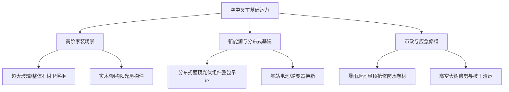

# 教学案例：从“遥控玩具”到“空中叉车”——工业无人机破解城市垂直吊运死局

**案例编号**：LAL-2026-02  
**案例主题**：低空物流 / 城市微物流 / 家装基建 / 工业无人机服务化（Servitization）  
**案例主角**：大疆运载（DJI Delivery）与城市高阶家装工程团队  
**适用课程**：《供应链与物流管理》、《低空经济商业模式创新》、《服务运筹学》、《微观经济学与成本精算》

---
视频资源： https://live.cflpai.com/front/video/preview?vid=8da279f5acc517ef2c38db175524b3d3_8

## 一、 执行摘要 (Executive Summary)

2026 年 4 月，上海闵行区某老旧高端别墅区发生了一场颠覆传统施工逻辑的吊运作业：一台重达 **380 斤（约 190kg）** 的重型中央空调外机，需要被安装在高度 80 米、坡度达 35 度的斜瓦屋顶上。

按传统家装工程模式，该场景面临典型的“三窄一高”死局——**巷子窄**（大型汽车吊车进不去）、**邻距近**（施工支腿无法展开）、**瓦顶斜**（无作业平台）、**成本倒挂高**（搭建高空脚手架耗时数天且造价远超设备本身）。最终，施工团队引入大疆 **FC200（FlyCart 200）** 工业重载无人机，采用“3 吨级高强度索具 + 四电轮换悬停解扣”方案，仅用 **5 分钟** 即完成了垂直吊运与精准落位。作业全程不接触建筑立面、不破坏社区绿化、无需疏解小区人群。

本案例深入剖析了民用工业无人机从早期“消费级航拍玩具”到“测绘巡检”，再跨越至“重载空中叉车”的商业演进路径。重点探讨：无人机如何通过将“最后一公里垂直运输”转化为“按次计费的服务包（Pay-per-use Service）”，破解城市微基建中的场景死局，以及其在法规空域审批、保险定损体系与标准化服务网络跟进后，如何成为低空经济中率先跑通商业付费闭环的战略分支。

---

## 二、 冲突爆发：城市改造中的“最后 100 米垂直瘫痪”

随着城市存量房更新与高端住宅改造浪潮的到来，高阶家装与微型基建频繁面临传统工程机械失效的窘境。本案中的上海闵行别墅区即为最显著的缩影。

### 1. 物理环境与工程死局

业主订购了一套 380 斤的中央空调重型主机，要求精准安装在别墅斜瓦屋顶上（高度 80 米，相当于 25 层楼高）。现场踏勘后，工程团队提出了三种传统方案，但均因客观条件限制而宣告失败：

```
[传统方案 A: 大型汽车吊车] 
 └── 阻碍：别墅区内部干道宽仅 3.2 米，20 吨级吊车拐弯困难，支腿无法铺开；压坏社区大理石路面及地下管网预估需赔偿数万元。

[传统方案 B: 脚手架搭建 + 人工搬运] 
 └── 阻碍：搭设 80 米斜顶高空脚手架需 4 名专业架子工连续作业 3 天，费用高达 8,000 元以上，且斜瓦顶承重与踩踏破损风险极高。

[传统方案 C: 楼梯间/电梯间人工抬升] 
 └── 阻碍：客梯承重上限与井道尺寸受限，转角楼梯狭窄无法过拐，设备极其容易刮伤业主内部精装修。
```

### 2. 商业决策困境：成本倒挂与效率悖论

对于家装承包商与设备供应商而言，垂直运输陷入了典型的**“成本倒挂”**：
* **运输成本 > 设备成本**：380 斤空调外机单价约 2.5 万元，但传统吊运及场地恢复的综合隐形成本占设备价值的 30%~40%。
* **施工周期坍塌**：原本半天完成的安装，被拖延至 3~4 天的“搭建-吊运-拆除”全周期，严重影响多工种协同交接。
* **极高的社会隐形负外部性**：大型机械长时间占用道路引发邻里投诉、噪音扰民、甚至面临社区物业的行政罚款。

矛盾核心焦点在：**是否存在一种既不占用地面空间、又不需要长时间搭设物理结构、能够实现高精度按次付费的垂直运力供给？**

---

## 三、 解决方案：大疆 FC200“空中叉车”作业复盘

在传统工程手段全部失效的背景下，现场工程团队联同大疆运载授权服务商，决定启用最新的 **DJI FlyCart 200（FC200）** 工业级重载无人机进行“空中直飞投送”。

```
                   [飞行路径: 直线上升80m / 5分钟]
 80m 屋顶斜瓦区  -------------------------------------> [精准悬停与解扣卸载]
                                                         ▲
                                                         │ (3吨级高强度缆索)
                                                         │
 0m 地面起吊区   [380斤空调外机 + 地面控制站] ────────────┘
```

### 1. 设备与技术配置

* **运力平台**：大疆 FC200 工业运载无人机（单机最大有效载重达 200 公斤 / 400 斤），配备四轴八桨多动力冗余系统。
* **智能索具系统**：采用 3 吨级高强度轻量化芳纶绳索，配备自动消摆（Anti-sway）控制算法与高精度传感器，实时抵消风切变对重物摆幅的影响。
* **控制与解扣机制**：四电轮换悬停解扣系统，支持空中毫米级悬停，结合地面/屋顶双视区（Dual-vision）联络员，实现无物理接触式自动脱钩。

### 2. 作业 SOP 流程解析

1. **环境与气象预判（T-30 Min）**：通过微气象站测量 80 米高空实时风速（需小于 12m/s），建立方圆 30 米无干扰电子围栏隔离区。
2. **重心调平与索具扣挂（T-10 Min）**：计算空调外机质心，采用四点平衡吊索系留，防止起吊瞬间发生偏轴晃动。
3. **垂直拉升与悬停（T-0 到 T-3 Min）**：FC200 双电池组全力输出，空吊起飞直升 80 米，垂直上升速率达 3.5m/s。
4. **屋顶精准卸载与脱钩（T-3 到 T-5 Min）**：机载激光雷达与屋顶联络员协同定位，外机轻缓放置于预设减震支架上，智能解扣自动脱钩。无人机返航降落。

**结果**：全程作业净时间仅 **5 分钟**，未出动任何大型工程机械，零绿化破损、零建筑划痕、零社区投诉。

---

## 四、 经济性与商业模式比对

本案例展现了工业无人机将“固定资产租赁/工程建造”重模式，转化为“按次计费（Pay-per-use）”轻服务的经济优势。

### 1. 传统方案 vs. 无人机方案 经济账精算表

| 对比维度 | 传统起重机方案 | 脚手架+人工方案 | FC200 无人机“空中叉车”方案 | 商业增益 |
| :--- | :--- | :--- | :--- | :--- |
| **作业总耗时** | 1 天（含搬运与封路） | **3 ~ 4 天**（搭架+运送+拆架） | **5 分钟（实飞）** + 30 分钟预备 | **时效提升 95%+** |
| **直接经济支出** | 3,500 ~ 5,000 元/次 | 6,000 ~ 8,000 元/次 | **1,200 ~ 1,800 元/次**（服务包） | **直接成本降低 60%~75%** |
| **毁损赔偿预备金** | 高（路面/地下管线） | 中（斜瓦破损/墙面划伤） | **极低（零物理接触）** | 消除隐形成本风险 |
| **作业人员配置** | 5 人（司机、指挥、搬运） | 4~6 人（架子工、搬运工） | **2 人**（持证飞手+地面解扣员） | **节省 60% 以上人工** |
| **计费与服务模式** | 按天/按台班租赁（起租门槛高） | 工程包工制 | **按次服务包（Pay-per-drop）** | 用户买单门槛大幅降低 |

### 2. 单位经济模型（Unit Economics）分析

对于无人机运载服务商而言：
* **设备折旧**：FC200 设备单价及备件投入，按 3,000 算力/起降架次折旧，单次折旧成本约 80~120 元。
* **电池与电力损耗**：高倍率快充电池循环使用，单次吊装电费及电池衰减成本约 30~50 元。
* **人工与飞手成本**：双人团队单次作业耗时 1 小时（含勘测），摊分人力成本约 200~300 元。
* **单次毛利率**：在单架次收费 1,500 元的情况下，**单次毛利率可达 65%~75%**，具备极强的商业自我造血能力。

---

## 五、 场景拓展：低空微物流的“杠杆效应”

空调外机吊运仅是“空中叉车”应用场景的冰山一角。以 FC200（单机 200kg / 四机协同 600kg 运力上限）为代表的工业无人机，正在撬动泛家装与微基建的广大市场：



1. **分布式屋顶光伏**：农村与别墅屋顶光伏铺设中，成箱光伏板与逆变器无损快速吊运，解决陡峭屋顶手动搬运极易划伤电池片的问题。
2. **超大件整体卫浴与岩板**：现代豪装中无法进电梯的超大尺寸整体石材、岩板桌面、异形穹顶玻璃，通过无人机进行外墙平移吊送。
3. **老旧小区与山地施工**：电梯改造部件、山地景区缆车配件、高海拔基站电池组的精准送达。

---

## 六、 跑通商业闭环的三大阻碍与破局路径

尽管场景逻辑成立且经济性显著，但工业无人机要从“单点试点”走向“规模化商业闭环”，仍需跨越三大战略关口：

```
┌─────────────────────────────────────────────────────────┐
│                    三大战略关口                         │
├────────────────────┬───────────────────┬────────────────┤
│ 1. 法规空域与特批   │ 2. 按单投保险种   │ 3. 标准化 SOP  │
│ (Airspace & Law)   │ (Insurance Rate)  │ (Delivery SOP) │
└────────────────────┴───────────────────┴────────────────┘
```

### 1. 空域与城市密集区合规（Airspace & Civil Regulations）
* **痛点**：上海等超大城市密集的低空空域管理极为严格，传统“一事一报”审批周期可能长达数天，挤压了应急吊运的时效优势。
* **破局路径**：推动低空空域数字化管理（UTM），开辟城市“微型低空运输绿色通道”，实行网格化空域预备案与自动化合规校验。

### 2. 商业保险与定损体系（Insurance & Liability）
* **痛点**：传统无人机机身险不包含“重载物品高空坠落引发的第三方豪宅/人员财产损失”。
* **破局路径**：大疆与平安、太保等头部险企合作，开发**“随单投保（Pay-per-flight Insurance）”** 的场景化高空微吊装责任险，按单自动扣费，打消业主与施工方的后顾之忧。

### 3. 服务商标准化 SOP 与网络建设（Service Network）
* **痛点**：从“卖无人机设备”向“交付吊运服务”转型，缺乏懂工程施工、懂风控消摆、持专业 CAAC 执照的复合型飞手团队。
* **破局路径**：建立“场地勘测-气象测算-索具配平-双视角解扣”标准化培训认证体系，输出加盟式区域服务节点。

---

## 七、 教学笔记 (Teaching Note)

### 1. 教学目标 (Learning Objectives)

* **理解服务化转型（Servitization）**：探讨硬件制造企业（大疆）如何从单卖设备转变为赋能按次计费的服务生态。
* **掌握边际成本与隐形成本精算**：分析在极窄空间与高隐形成本约束下，替代性技术的全寿命周期经济学模型。
* **低空经济商业化落地评估**：辨析低空经济中“客运 eVTOL”、“末端快递配送”与“工业重载空中叉车”在商业闭环跑通速度上的差异。

### 2. 破题与讨论问题 (Assignment Questions)

1. **问题 1（成本与决策）**：如果你是该家装工程的负责人，在面对“传统脚手架方案（8000元，耗时3天，破损风险高）”与“无人机方案（1500元，耗时5分钟，技术风险）”时，你需要考量哪些非财务因素？
2. **问题 2（商业模式）**：大疆在此类场景中应当直接面向终端业主提供吊装服务，还是应当作为 Tier-2 运力赋能给家装公司/物流代理？为什么？
3. **问题 3（风险与博弈）**：假设在吊运过程中发生突发风切变导致空调外机撞击墙面，责任应如何在“设备厂商”、“无人机服务商”、“家装公司”与“险企”之间切分？

### 3. 冷场预案与引导话术 (Cool-down Plan & Guidance)

* **当学员认为“直接买一台 FC200 自己吊装最划算”时**：
  * *引导话术*：“单台 FC200 硬件及配套投资在十万元级别，且需要持证飞手与空域审批资质。普通家装公司年吊运频次是否足以支撑设备折旧与人员固定成本？这是否说明‘运力即服务（Transport-as-a-Service）’才是最优解？”
* **当学员质疑“无人机吊运只适用于别墅区这种小众场景”时**：
  * *引导话术*：“除了别墅区空调，城市老旧小区电梯加装、分布式光伏大范围铺设、高层建筑幕墙玻璃更换是否面临同样的‘狭窄空间+高额脚手架成本’问题？这一市场的基数有多大？”

### 4. 板书设计 (Board Plan)

```
┌───────────────────────────────────────────────────────────────────────────┐
│              从“遥控玩具”到“空中叉车”：无人机微物流商业化                 │
├─────────────────────────────────────┬─────────────────────────────────────┤
│ 1. 痛点：最后100米垂直瘫痪          │ 2. 破局：按次计费服务包 (PaaS)      │
│  - 物理死局：窄巷 / 斜顶 / 近距离   │  - 降本：成本 -70%，耗时 -95%       │
│  - 经济悖论：运费成本 > 设备成本   │  - 零接触：无绿化/墙面隐形毁损      │
├─────────────────────────────────────┼─────────────────────────────────────┤
│ 3. 泛化场景矩阵                     │ 4. 商业闭环三要素                   │
│  - 家装：超大玻璃 / 整体石材       │  - 空域：微型通道自动化备案         │
│  - 能源：分布式屋顶光伏组件         │  - 保险：按单扣费高空坠物责任险     │
│  - 应急：灾后瓦屋顶抢修与防水       │  - SOP：持证飞手与标准化吊装网络    │
└─────────────────────────────────────┴─────────────────────────────────────┘
```

---
*本案例由案例开发团队制作，供课堂教学与商业决策讨论使用。*
