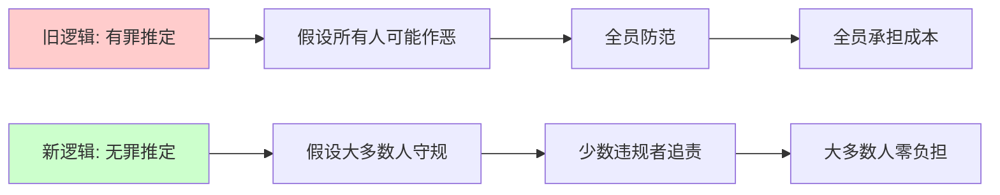
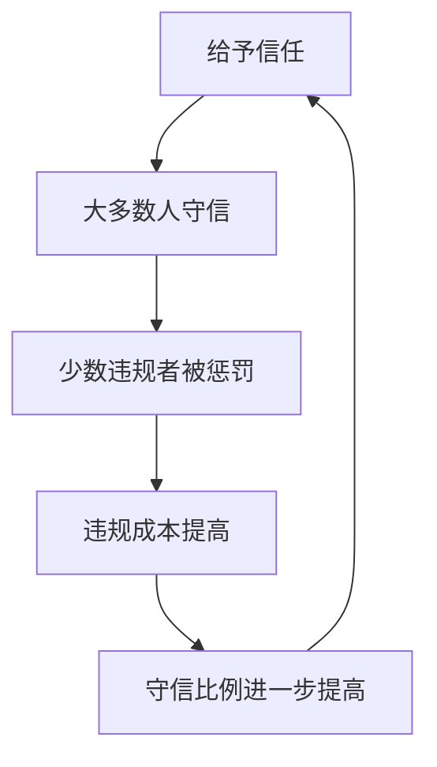

# 案例研究：酒店退房逻辑的变革与信任成本

## 案例概述

**案例名称**：从"查房后退房"到"退房后查房"——酒店管理模式的信任转型  
**行业领域**：酒店服务业  
**案例类型**：服务流程优化 / 信任机制设计  
**时间跨度**：2010年代至今  
**核心议题**：成本效益 vs 风险控制 / 信任机制 vs 防范机制

---

## 现象观察

### 传统模式（2010年代及之前）

**退房流程**：
```
客人前台提出退房 
    ↓
"稍等，查一下房" 
    ↓
服务员上楼检查
• 毛巾在不在？
• 杯子碎没碎？
• 冰箱饮料少没少？
    ↓
确认无误后办理退房
    ↓
客人离开
```

**时间成本**：通常需要等待 10-15 分钟  
**客人体验**：排队、等待、被"审查"的感觉

---

### 新兴模式（2020年代）

**智能化退房流程**：
```
方式一：前台退房
房卡往前台一放 → 直接离开

方式二：无接触退房
手机App点击"退房" → 房卡投入回收箱 → 完成

方式三：全自动退房
从自助机取卡 → 从自助机退卡 → 系统自动扣款
```

**后置检查机制**：
```
客人离开
    ↓
保洁进房清扫
    ↓
发现问题（如有）
    ↓
通过订单/预授权联系客人处理
```

**新型服务体验**：
- 💬 接到电话："先生，您在酒店里留了一根充电线，要不要给您寄回去？"
- 而不是："先生，您房间少了毛巾，需要赔偿。"

---

## 逻辑转变

### 核心转变

| 维度 | 旧逻辑 | 新逻辑 |
|------|--------|--------|
| **信任前提** | 有罪推定 | 无罪推定 |
| **检查时机** | 客人离开前 | 客人离开后 |
| **核心理念** | "你没走之前，我先证明你没拿东西" | "你先走，真有问题我再找你" |
| **防范对象** | 所有客人 | 少数违规客人 |
| **成本承担** | 全体客人（时间） | 酒店（偶发损失） |

---

## 成本分析

### 旧模式的隐性成本

**1. 人力成本**
- 需要专门的查房人员
- 前台需要协调查房进度
- 高峰期人力紧张

**2. 时间成本**
- 客人平均等待 10-15 分钟
- 高峰期前台排队拥堵
- 影响客人行程安排

**3. 体验成本**
- 客人被"怀疑"的心理不适
- 退房体验差影响复购率
- 负面口碑传播

**4. 机会成本**
- 服务员被占用，无法服务其他客人
- 前台拥堵影响新客人入住效率

**总成本估算**（单间/次）：
```
人力：5-8元
时间：客人10分钟 × 时间价值
体验：潜在流失率影响
--------------------------------
显性+隐性成本：15-30元/间次
```

---

### 新模式的成本收益

**新增技术成本**：
- 智能门锁系统
- 自助入住/退房设备
- 在线支付与预授权系统

**减少的成本**：
- ✅ 减少人工查房环节
- ✅ 提升客人满意度
- ✅ 提高退房效率（3-5倍）
- ✅ 降低前台压力

**偶发损失**：
- 低价值物品（毛巾、拖鞋）：10-30元/件
- 发生率：<5%
- 年度损失：可控范围

**ROI 分析**：
```
技术投入：一次性 5-10 万元（100间规模）
年度运营节省：人力 + 体验提升
投资回收期：1-2 年
长期收益：持续的效率提升与体验优化
```

---

## 技术支撑

### 风险防控的新手段

**1. 实名制体系**
- 身份证实名登记
- 手机号绑定
- 支付账户关联
→ "查无此人"的概率极低

**2. 数字化追溯**
- 智能门锁记录（开关门时间）
- 公共区域监控
- 订单完整记录
→ 行为可追溯

**3. 信用约束**
- 支付宝/微信信用分
- 酒店会员信用体系
- 黑名单共享机制
→ 违规成本高

**4. 预授权机制**
- 入住时冻结押金（200-500元）
- 退房后自动解冻
- 有问题时直接扣款
→ 事后处理简便

**5. 物联网技术**
- 智能冰箱（自动记录消费）
- 智能保险柜（使用记录）
- 智能设备监控（电视、空调）
→ 实时感知异常

---

## 案例洞察

### 一、成本-收益的重新计算

**发现**：
> 为了防止极少数人拿走几十块钱的物品，让所有客人退房时等 10 分钟，前台排长龙，酒店付出的人工和体验成本可能更高。

**量化对比**（以 100 间客房、70% 入住率为例）：

| 项目 | 旧模式年成本 | 新模式年成本 | 差值 |
|------|-------------|-------------|------|
| 查房人力 | 18 万元 | 0 | ↓ 18 万 |
| 客人时间损失 | 无形 | 0 | 体验提升 |
| 偶发物品损失 | 0.5 万元 | 3 万元 | ↑ 2.5 万 |
| 技术摊销成本 | 0 | 5 万元/年 | ↑ 5 万 |
| **净收益** | - | - | **↓ 10.5 万** |

结论：**即使物品损失增加，综合成本仍显著降低。**

---

### 二、信任机制的演进

**从"有罪推定"到"无罪推定"**：



**关键认知转变**：
1. 大多数人是守规矩的（95%+）
2. 为了防 5% 的人，让 95% 的人都难受，不值得
3. 技术可以降低事后追责的成本

---

### 三、制度设计的哲学

**核心原则**：
> 不要让大多数人来承担少数人的恶。

**制度设计的两种思路**：

**思路A：防君子也防小人**
- 特点：天衣无缝，无懈可击
- 代价：所有人都承担成本
- 结果：高成本、低效率、差体验

**思路B：信任君子，惩罚小人**
- 特点：信任前置，追责后置
- 代价：少数违规者的损失
- 结果：低成本、高效率、好体验

**现实选择**：
当技术足以支撑"事后追责"时，思路B 明显优于思路A。

---

### 四、社会成本的优化

**微观层面（单个酒店）**：
- 人力成本 ↓
- 运营效率 ↑
- 客户满意度 ↑
- 复购率 ↑

**行业层面（酒店业）**：
- 推动行业服务标准升级
- 促进技术投入与创新
- 形成信任机制的良性循环

**社会层面**：
- 减少无谓的"摩擦成本"
- 提升社会整体信任水平
- 为大多数守规者创造更好的体验

**哲学意义**：
> 让制度管住少数人，给大多数人信任，这个社会才会以更低的成本运行。

---

## 适用边界

### 这种模式适用的前提条件

**1. 技术成熟度**
- ✅ 实名制体系完善
- ✅ 数字支付普及
- ✅ 追溯技术可靠

**2. 损失可控性**
- ✅ 主要是低价值物品
- ✅ 贵重物品有特殊保护措施
- ✅ 整体损失率低于某个阈值（如年营收的 0.5%）

**3. 违规成本足够高**
- ✅ 信用体系健全
- ✅ 法律追责可行
- ✅ 黑名单机制有效

**4. 客户群体特征**
- ✅ 以商务、休闲客人为主
- ✅ 非高风险客群
- ✅ 复购率重要

---

### 不适用的场景

**场景一：高价值物品**
- 如：豪华套房的艺术品、名贵酒水
- 仍需特殊管控

**场景二：特定客群**
- 如：短租房、青旅（流动性极高，追责困难）
- 可能仍需前置检查

**场景三：技术不成熟地区**
- 实名制不完善
- 支付体系落后
- 追溯困难

---

## 延伸思考

### 其他领域的类似变革

**1. 共享单车**
- **旧模式**：停车桩，必须停在固定位置
- **新模式**：无桩停放，GPS定位，违规停放后置罚款
- **逻辑**：信任大多数人会规范停放

**2. 超市自助结账**
- **旧模式**：所有顾客必须经过人工收银
- **新模式**：自助扫码，抽查+技术监控
- **逻辑**：信任大多数人不会偷窃

**3. 地铁安检**
- **争议点**：是否所有人都需要安检？
- **成本**：巨大的时间成本 × 客流量
- **反思**：能否用技术手段（如AI识别）替代全员安检？

**4. 高速公路收费**
- **旧模式**：停车取卡，停车缴费
- **新模式**：ETC不停车通行，违规后追缴
- **逻辑**：信任大多数人会遵守规则

---

### 制度设计的启示

**启示一：成本的全局视角**
- 不仅看直接成本（物品损失）
- 更要看隐性成本（时间、体验、机会）

**启示二：技术的赋能作用**
- 技术降低了"事后追责"的成本
- 使"信任前置"成为可能

**启示三：人性的基本假设**
- 如果假设大多数人是善的 → 低成本社会
- 如果假设大多数人是恶的 → 高成本社会

**启示四：信任的正向循环**


---

## 案例价值

### 管理学价值
- **服务流程优化**：从"防范型"到"信任型"
- **成本管理**：显性成本 vs 隐性成本的权衡
- **客户体验管理**：减少不必要的"摩擦点"

### 社会学价值
- **信任机制研究**：如何建立低成本的社会信任
- **制度设计哲学**：为谁设计？防谁？成本谁承担？
- **技术与社会**：技术如何改变信任模式

### 经济学价值
- **交易成本理论**：降低交易中的信任成本
- **激励机制设计**：惩罚少数 vs 限制全体
- **帕累托改进**：在不损害少数人的前提下，让多数人获益

### 伦理学价值
- **有罪推定 vs 无罪推定**
- **集体惩罚的正当性**
- **自由与秩序的平衡**

---

## 讨论问题

### 供管理者思考
1. 你的组织中，有哪些制度是"为了防 5% 的人，让 95% 的人承担成本"？
2. 如果引入技术手段，能否实现"信任前置，追责后置"？
3. 在你的领域，"信任"的成本收益如何计算？

### 供政策制定者思考
1. 哪些公共政策可以从"全员防范"转向"重点监控"？
2. 技术进步是否改变了公共管理的可能性边界？
3. 如何在效率与公平之间找到平衡点？

### 供公民思考
1. 你愿意为社会的整体信任水平提升，承担多少"被信任"的风险？
2. 当技术可以降低追责成本时，我们是否应该给彼此更多信任？
3. 一个处处防范的社会 vs 一个普遍信任的社会，你选哪个？

---

## 结论

酒店退房逻辑的变化，表面上是一个服务流程的优化，实质上是一次**信任机制的重构**。

它告诉我们：

1. **大多数人是值得信任的**  
   不要让少数人的恶，成为惩罚所有人的理由。

2. **技术可以降低信任的成本**  
   当"事后追责"足够高效时，"事前防范"就不必过度。

3. **制度设计要算总账**  
   不是让规则"天衣无缝"，而是让社会"低成本运行"。

4. **信任本身是一种投资**  
   给予信任，收获的是效率、体验和更高的信任回报。

---

**最后一句话**：

> 如果把大多数人都当成了贼，采用了有罪推定，那么看上去规则天衣无缝，但是所有人都承担了成本。

**这个案例提醒我们**：

在设计任何制度、流程、规则时，都要问自己：

- 我们在防谁？
- 成本谁承担？
- 有没有更低成本的方式？
- 技术能否改变游戏规则？

**答案可能会改变很多东西。**

---

## 参考资料

### 延伸阅读
1. 《信任：社会美德与创造经济繁荣》- 弗朗西斯·福山
2. 《制度、制度变迁与经济绩效》- 道格拉斯·诺斯
3. 《交易成本经济学》- 奥利弗·威廉姆森
4. 《助推》- 理查德·塞勒（关于制度设计的行为经济学视角）

### 相关案例
- 新加坡的"鱼尾狮"城市管理模式
- 日本便利店的无人收银信任机制
- 北欧国家的高信任社会建设

---

*本案例基于真实观察整理，旨在引发对信任机制与制度设计的思考。*

---

## 附录：数据支持（假设数据，仅供说明逻辑）

### 表1：退房模式对比数据

| 指标 | 传统查房模式 | 智能退房模式 | 变化 |
|------|------------|-------------|------|
| 平均退房时长 | 12 分钟 | 2 分钟 | ↓ 83% |
| 客人满意度 | 3.5/5 | 4.5/5 | ↑ 29% |
| 前台人力需求 | 3 人/班 | 1 人/班 | ↓ 67% |
| 年度物品损失率 | 2% | 4% | ↑ 2% |
| 年度物品损失额 | 2 万元 | 4 万元 | ↑ 2 万 |
| 年度人力成本 | 25 万元 | 12 万元 | ↓ 13 万 |
| 净成本变化 | - | - | **↓ 11 万** |

### 表2：客户体验调研（样本：1000位客人）

| 问题 | 传统模式 | 智能模式 |
|------|---------|---------|
| 觉得退房很方便 | 45% | 89% |
| 愿意再次入住 | 62% | 85% |
| 觉得被信任 | 38% | 78% |
| 会推荐给朋友 | 51% | 82% |

---

**案例整理完成时间**：2026年8月  
**案例整理者**：基于真实观察  
**适用场景**：管理学教学、制度设计研讨、信任机制研究
