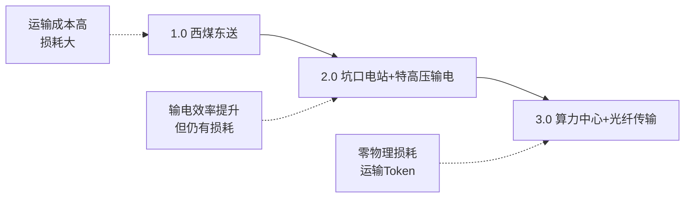
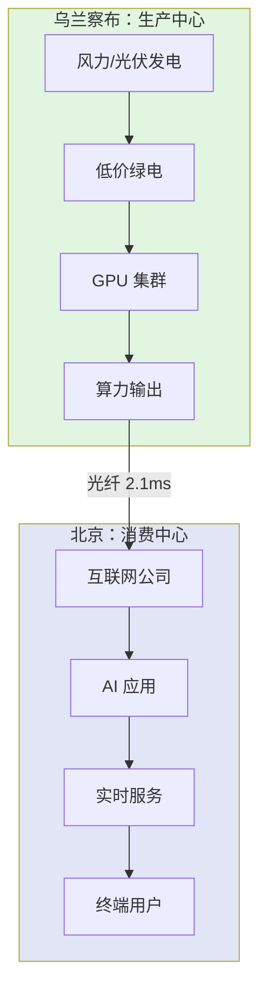

# 案例：算力中心选址——为什么乌兰察布成为了首选

**核心洞察：当乌兰察布成为算力中心，竞争进入了毫厘时代**

## 一、现象：爆发式增长背后的选址逻辑

### 数据冲击

2024 年底，乌兰察布只有 36 个数据中心项目。

到 2026 年 6 月，这个数字变成了 **89 个**。

- 签约总投资：**超过 5000 亿元**
- 运行算力：**16.5 万 P**
- 其中承接北京外溢算力：**约 6.5 万 P**

一个内蒙古的地级市，在 18 个月内成为中国最密集的算力聚集地之一。

### 问题

为什么是乌兰察布？

为什么不是其他"东数西算"节点城市（如庆阳、银川、中卫）？

算力中心的选址逻辑，到底发生了什么变化？

## 二、三大核心优势：毫厘之间的竞争力

### 优势 1：距离——毫秒级时延的价值

**最直接的优势，是离北京近。**

| 城市 | 距离北京 | 单向时延 | 双向时延 |
|------|---------|---------|---------|
| **乌兰察布** | 300+ 公里 | ~2.1 毫秒 | ~4.2 毫秒 |
| 庆阳 | 900 公里 | ~6+ 毫秒 | ~12+ 毫秒 |

#### 时延为什么突然变得重要？

**过去（AI 训练时代）**：
- 主要业务：模型训练、数据存储、备份
- 时延敏感度：低
- 多几毫秒影响不大

**现在（AI 推理时代）**：
- 主要业务：实时推理、在线模型、智能应用调用
- 时延敏感度：高
- 每增加 1 毫秒，用户体验下降明显

**乌兰察布的独特价值**：
- 拿着西部的成本
- 享受接近北京的时延
- 这是**地理套利**的完美案例

### 优势 2：电力——毫厘之间的巨额差距

| 地区 | 到户电价 | 100MW 年耗电 | 年电费差异 | 500MW 年电费差异 |
|------|---------|-------------|-----------|----------------|
| 庆阳 | ~0.40 元/度 | 8.76 亿度 | - | - |
| **乌兰察布** | ~0.358 元/度 | 8.76 亿度 | **-3500 万元** | **-1.75 亿元** |

**电价差只有 4 分钱，但规模化后就是巨额现金流。**

#### 能源输送形态的演进



**内蒙古的身份转变**：
- 过去：把电送到东部
- 现在：**把 GPU 搬到电厂旁边，再把 Token 送到东部**

### 优势 3：气候——自然冷源的能耗优势

**乌兰察布年平均气温：约 4℃**

#### 冷却系统的成本意义

数据中心的两大能耗来源：
1. **计算设备**（GPU/CPU）：60-70%
2. **冷却系统**：30-40%

**低温带来的复合优势**：
- 大部分时间可利用自然冷源
- 减少制冷设备运行时间
- 进一步降低用电成本
- 延长设备寿命

#### PUE 值对比

PUE（电源使用效率）= 数据中心总能耗 / IT 设备能耗

- 传统数据中心：PUE ≈ 1.8-2.0
- 乌兰察布算力中心：PUE ≈ 1.2-1.3
- **意味着每消耗 1 度计算用电，只需额外消耗 0.2-0.3 度冷却用电**

## 三、战略意义：算力卫星城的崛起

### 空间关系重构

如果把北京看成一个巨大的 **AI 算力消费中心**，

乌兰察布正在成为北京的 **"算力卫星城"**。



### 新型配送中心逻辑

| 时代 | 生产要素 | 生产地 | 消费地 | 运输方式 | 核心成本 |
|------|---------|--------|--------|---------|---------|
| 1.0 | 煤炭 | 西部矿区 | 东部城市 | 铁路/汽运 | 运输成本+损耗 |
| 2.0 | 电力 | 坑口电站 | 东部城市 | 特高压 | 输电损耗+建设成本 |
| **3.0** | **Token** | **算力中心** | **东部城市** | **光纤** | **时延+电价** |

**本质上都是一回事**：
- 如何用最低的成本生产
- 然后高效送到最需要的地方

**但竞争单位已经进化**：
- 时间：从小时 → 秒 → **毫秒**
- 成本：从元 → 角 → **分 → 毫厘**

## 四、深层变革：产业生态的重塑

### 1. 西部地区的角色转变

**过去的西部**：
- 能源输出地（煤、电）
- 低技术含量
- 人才流失严重

**现在的西部**：
- 算力生产地（Token）
- 高技术密集
- **从未有过的高科技人员涌入**

### 2. 新兴职业的诞生

**算力运维工程师**：
- 不同于传统 IT 运维
- 需要理解：
  - GPU 集群调度
  - 能耗优化
  - 网络时延优化
  - 冷却系统管理
- **在草原上维护最前沿的 AI 基础设施**

### 3. 城市消费端的无感体验

**城市里的场景**：
- 实时 AI 翻译
- 智能客服对话
- 自动驾驶计算
- 内容生成应用

**用户感知**：
- 毫秒级响应
- 完全无感知算力来自 300 公里外的草原

**实际情况**：
- 都在享受着远方毫秒级算力的响应
- 背后是乌兰察布的 GPU 集群在燃烧绿电

## 五、全球视角：AI 时代的新平衡

### 同样的逻辑在全球复制

**美国**：
- 俄勒冈州、爱达荷州成为算力中心
- 低电价 + 凉爽气候 + 靠近西海岸

**欧洲**：
- 北欧国家（瑞典、芬兰）吸引数据中心
- 低温 + 绿电 + 接近主要市场

**中国的独特性**：
- 市场规模更大
- 能源成本差异更显著
- 网络基础设施建设更快

### 竞争的新维度

**AI 时代的选址决策模型**：

```
综合竞争力 = f(电价, 时延, 气温, 网络带宽, 政策支持, 人才供给)

其中：
- 电价权重：35%
- 时延权重：30%
- 气温权重：15%
- 其他：20%
```

**乌兰察布的得分**：
- 电价：9/10（接近全国最低）
- 时延：10/10（300 公里黄金距离）
- 气温：9/10（年均 4℃）
- 网络：9/10（直连北京光缆）
- 政策：8/10（东数西算节点）
- **综合得分：领先**

## 六、案例启示：毫厘之间的战略思维

### 启示 1：量变到质变的临界点

**4 分钱电价差**，在小规模时无足轻重。

但在 **500MW** 规模时，就是 **1.75 亿元/年** 的差距。

**教训**：
- 在规模化业务中，微小的单位成本差异会被放大到战略级别
- 不要忽视"毫厘"级的优化

### 启示 2：地理套利的系统性思维

乌兰察布的成功，不是单一优势，而是**组合拳**：

```
西部成本（电价 + 气候）+ 东部时延（距离 + 网络）= 无法复制的优势
```

**教训**：
- 寻找不同区域要素成本的套利空间
- 组合多个中等优势，形成系统性竞争壁垒

### 启示 3：技术进步改变区位价值

**时延敏感度的变化**：
- AI 训练时代：庆阳够用
- AI 推理时代：乌兰察布突然值钱

**教训**：
- 技术演进会改写区位价值
- 今天的劣势，可能是明天的优势（反之亦然）
- 需要动态评估区位价值

### 启示 4：能源形态的持续演进

**从物理运输到信息运输**：
- 1.0：运煤（损耗大，效率低）
- 2.0：输电（损耗降低，效率提升）
- 3.0：传 Token（零损耗，光速传输）

**教训**：
- 持续思考"什么可以被数字化、虚拟化？"
- 信息传输永远比物质传输更高效

### 启示 5：产业链的空间重构

**传统逻辑**：
- 生产靠近消费地（降低物流成本）

**新逻辑**：
- 生产靠近要素成本洼地（能源、土地）
- 用高速网络连接消费地
- **前提是：产品可以零成本、零损耗传输**

**教训**：
- 重新审视产业布局
- 哪些环节可以远程化？
- 哪些环节必须本地化？

## 七、延伸思考：竞争的下一站

### 问题 1：乌兰察布的优势能持续多久？

**潜在威胁**：
- 其他城市跟进（如包头、呼和浩特）
- 电价优势缩小（绿电普及）
- 技术突破（量子通信、卫星网络）

**应对策略**：
- 规模效应（先发优势建立生态）
- 产业集群（吸引上下游）
- 持续优化（运维效率、能耗管理）

### 问题 2：下一个"乌兰察布"会在哪里？

**候选区域特征**：
- 距离超大城市 200-400 公里
- 有低成本能源（风、光、水）
- 有凉爽气候
- 有高速网络基础设施

**可能的候选**：
- 张家口（服务北京）
- 延安（服务西安）
- 九江（服务长三角）

### 问题 3：毫厘竞争的终局是什么？

**可能的演进路径**：

1. **极致优化阶段**（当下）
   - 榨取每一分钱成本差
   - 争取每一毫秒时延优势

2. **技术突破阶段**（未来 5 年）
   - 更高效的芯片（降低能耗）
   - 更快的网络（降低时延敏感度）
   - 更好的冷却技术（降低气候依赖）

3. **新平衡阶段**（未来 10 年）
   - 优势重新洗牌
   - 新的地理套利空间出现
   - 可能回归分布式部署

**不变的核心**：
- 在成本和体验之间找最优解
- 在生产地和消费地之间找平衡点

## 八、行动建议

### 对企业决策者

**选址决策框架**：

1. **量化核心指标**
   - [ ] 计算年电费差异（按实际负载）
   - [ ] 测试实际网络时延（多次、多时段）
   - [ ] 评估冷却成本节约（按当地气候）
   - [ ] 计算综合 TCO（Total Cost of Ownership）

2. **评估隐性成本**
   - [ ] 人才招聘难度
   - [ ] 运维团队差旅成本
   - [ ] 供应链响应速度
   - [ ] 政策稳定性风险

3. **设计渐进策略**
   - [ ] 第一阶段：试点项目（验证假设）
   - [ ] 第二阶段：规模扩张（享受规模优势）
   - [ ] 第三阶段：生态建设（形成护城河）

### 对区域发展决策者

**打造算力中心的要素**：

1. **硬件基础**
   - [ ] 电力：稳定、低价、绿色
   - [ ] 网络：高带宽、低时延骨干网
   - [ ] 基础设施：数据中心园区、配套设施

2. **软件环境**
   - [ ] 政策：电价补贴、税收优惠、审批简化
   - [ ] 人才：引进计划、培训体系、生活配套
   - [ ] 产业链：吸引上下游企业

3. **差异化定位**
   - [ ] 避免同质化竞争
   - [ ] 找到独特优势组合
   - [ ] 建立品牌认知

### 对技术从业者

**新兴职业机会**：

1. **算力运维工程师**
   - 技能需求：GPU 集群管理、能耗优化、网络调优
   - 职业路径：运维 → 架构 → 技术管理
   - 地域机会：西部算力中心城市

2. **算力调度工程师**
   - 技能需求：分布式系统、调度算法、实时优化
   - 职业路径：算法 → 系统 → 平台
   - 市场需求：快速增长

3. **数据中心能效工程师**
   - 技能需求：热力学、能源管理、自动化控制
   - 职业路径：工程 → 设计 → 咨询
   - 行业趋势：碳中和推动需求

## 结语

**草原负责发电，GPU 负责烧电，最后顺着光纤送出去的，已经不是电了——是 Token。**

这是新时代的配送中心逻辑。

从送电、送货到送 Token，本质上都是一回事：
- 如何用最低的成本生产
- 然后高效送到最需要的地方

**但竞争的单位，已经是毫秒级的时延和毫厘级的成本差距。**

乌兰察布的故事告诉我们：
- 在规模化业务中，微小差异会被放大为战略优势
- 地理套利不是寻找单一优势，而是组合系统性优势
- 技术演进会持续改写区位价值
- **真正的竞争，在毫厘之间**

这不仅是中国的竞争，也是全球的竞争。

如何在能源中心和消费中心间找到最佳平衡点，是 AI 时代所有玩家必须回答的问题。

---

**案例数据来源时间：2026 年 6 月**  
**案例类型：产业选址、成本优化、地理套利**  
**适用场景：数据中心选址、算力中心规划、区域产业发展**
